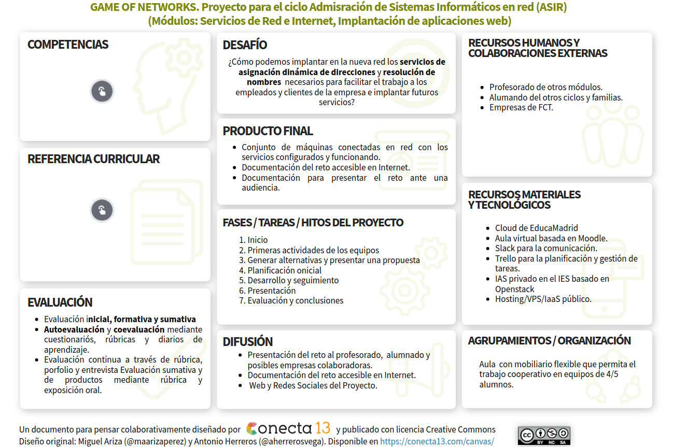

# Prototipo del proyecto GAME OF NETWORKS.

Proyecto para el ciclo Admisración de Sistemas Informáticos en red (ASIR)  (Módulos: Servicios de Red e Internet, Implantación de aplicaciones web).

Pincha sobre la imagen para acceder al canvas.

